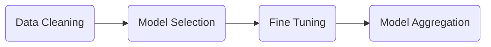

# Credit and Fraud Risk - Project

This is a project I was working on during my time in India at the Indian Institute of Technology Madras (IITM). 

### Problem Statement

Prediction of applicant going default in next 12 months from new credit card application.

### Data Details

Customer application and bureau data with the default tagging i.e., if a customer has missed cumulative of 3 payments across all open trades, his default indicator is 1 else 0. Data consists of independent variables at the time T0 and the actual performance of the individual (Default/ Non Default) after 12 months.

### **Sample Variables**
**Application Variables**:
 - Annual Income
 - Type of Card applied for – Charge / Lending
 -  Duration of stay at current address

**Bureau variables**

 - Performance on external credit card trades
 - Performance on other trades (Auto / Personal / Education / Mortgage Loan)

