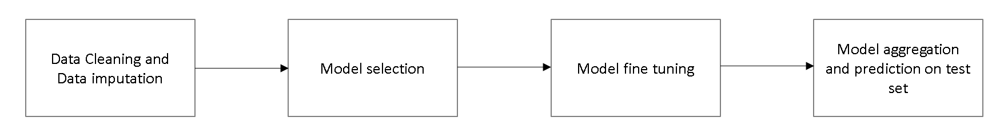

# Credit and Fraud Risk - Project

This is a project I was working on during my time in India at the Indian Institute of Technology Madras (IITM). 

### Problem Statement

Prediction of applicant going default in next 12 months from new credit card application.

### Data Details

Customer application and bureau data with the default tagging i.e., if a customer has missed cumulative of 3 payments across all open trades, his default indicator is 1 else 0. Data consists of independent variables at the time T0 and the actual performance of the individual (Default/ Non Default) after 12 months.

### **Sample Variables**
**Application Variables**:
 - Annual Income
 - Type of Card applied for – Charge / Lending
 -  Duration of stay at current address

**Bureau variables**

 - Performance on external credit card trades
 - Performance on other trades (Auto / Personal / Education / Mortgage Loan)

### **Machine Learning Pipeline**

**1. Data Cleaning**

 - Unify representation of missing values
 - Impute missing values (missRanger)
 - Feature selection (removing mvar48)
 - Application of centering and scaling

**2. Model selection**

**10-Fold Cross Validation (10,000 observations)**

 - Random Forest (ranger)
 - avNNet (caret)
 - KNN (caret)
 - XBoost (xgboost)
 - Multivariate adaptive regression spline (earth)
 - ROC-based classifier (rocc)
 - Linear discriminant analysis (MASS)
 - Boosted logistic regression (caTools)
 - penalized logistic regression (stepPlr)

The Performance estimation is based on Cohen's kappa coefficient, since training dataset contains imbalanced classes ( ”default” response values only constitute 28.74% )

**Top 3 Models**

 1. Random Forest (kappa = 0.3912873)
 2. Model Averaged Neural Networks (kappa = 0.3749375)
 3.  Tree Boosting Algorithm (kappe = 0.3747642)

**3. Model Fine Tuning**

***Subsample of 40,000 observations***
See R scripts

**3. Model Fine Tuning**

 - Aggregate top 3 models
 - simple mean-aggregate with good performance
 - Adjust threshold on 0.45, giving small bias towards detecting true "default" cases
 - Train models on whole available training dataset and predict on test dataset (submission.csv)
